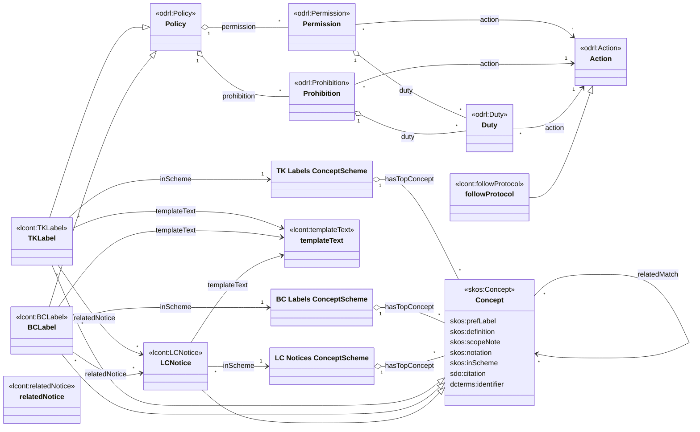

```mermaid
classDiagram
direction LR

%% Schemes (instances)
class TK_Scheme["TK Labels ConceptScheme"]
class BC_Scheme["BC Labels ConceptScheme"]
class Notices_Scheme["LC Notices ConceptScheme"]

%% Core SKOS
class Concept {
  <<skos:Concept>>
  skos:prefLabel
  skos:definition
  skos:scopeNote
  skos:notation
  skos:inScheme
  sdo:citation
  dcterms:identifier
}

TK_Scheme "1" o-- "*" Concept : hasTopConcept
BC_Scheme "1" o-- "*" Concept : hasTopConcept
Notices_Scheme "1" o-- "*" Concept : hasTopConcept

Concept "*" --> "*" Concept : broader/narrower
Concept "*" --> "*" Concept : relatedMatch

%% Local Contexts classes
class TKLabel { <<lcont:TKLabel>> }
class BCLabel { <<lcont:BCLabel>> }
class LCNotice { <<lcont:LCNotice>> }

TKLabel --|> Concept
BCLabel --|> Concept
LCNotice --|> Concept

TKLabel "*" --> "1" TK_Scheme : inScheme
BCLabel "*" --> "1" BC_Scheme : inScheme
LCNotice "*" --> "1" Notices_Scheme : inScheme

%% Declared lc-ont properties
class relatedNotice { <<lcont:relatedNotice>> }
TKLabel "*" --> "*" LCNotice : relatedNotice
BCLabel "*" --> "*" LCNotice : relatedNotice

class templateText { <<lcont:templateText>> }
TKLabel --> templateText : templateText
BCLabel --> templateText : templateText
LCNotice --> templateText : templateText

%% ODRL pattern
class Policy { <<odrl:Policy>> }
class Permission { <<odrl:Permission>> }
class Prohibition { <<odrl:Prohibition>> }
class Duty { <<odrl:Duty>> }
class Action { <<odrl:Action>> }

TKLabel --|> Policy
BCLabel --|> Policy

Policy "1" o-- "*" Permission : permission
Policy "1" o-- "*" Prohibition : prohibition
Permission "1" o-- "*" Duty : duty
Prohibition "1" o-- "*" Duty : duty
Permission "*" --> "1" Action : action
Prohibition "*" --> "1" Action : action
Duty "*" --> "1" Action : action

class followProtocol { <<lcont:followProtocol>> }
followProtocol --|> Action
```
